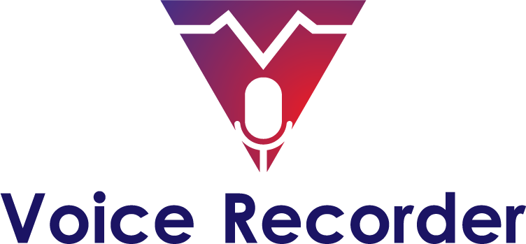

  

#
A simple styled audio voice recording app for Android

The main changes compared to the original version are a support for the runtime permissions (to store audio files to the local device), and some re-styling of the app design.

The original code is available at: https://github.com/dkim0419/SoundRecorder/

Credits / Libraries used:

https://github.com/makovkastar/FloatingActionButton

https://github.com/MohammadAG/Android-SoundRecorder

https://github.com/astuetz/PagerSlidingTabStrip
